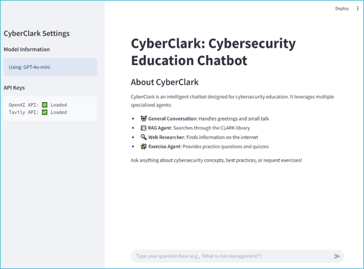

# CyberClark

[](https://github.com/yourusername/cyberclark)
[](https://www.python.org/)
[](LICENSE)

A sophisticated multi-agent LLM system for enhanced cybersecurity education leveraging the CLARK (Cybersecurity Labs and Resource Knowledge-base) library.

## 🔐 Overview

CyberClark is an intelligent educational platform designed to help students learn cybersecurity concepts through an interactive, conversational interface. The system employs multiple specialized AI agents to deliver comprehensive learning experiences, from answering knowledge questions to providing practical exercises.



*Screenshot of the CyberClark Streamlit interface*

## ✨ Key Features

- **Multi-Agent Architecture**: A supervisor coordinates between specialized agents to deliver optimal responses
- **Rich Content Integration**: Direct access to the CLARK library's cybersecurity educational resources
- **Interactive Learning**: Combines theoretical knowledge with practical exercises
- **Multiple Interfaces**: Available as both CLI and GUI applications
- **Persistent Memory**: Maintains context throughout conversations for a coherent learning experience

## 🤖 Agents

CyberClark employs four specialized agents:

- **General Conversation Agent**: Handles small talk and guides users toward cybersecurity topics
- **RAG Agent**: Searches through the CLARK library for authoritative cybersecurity information
- **Exercise Agent**: Provides existing and generates new exercises for students to practice
- **Web Researcher Agent**: Searches the internet for additional information when needed

## 🛠️ Installation

### Prerequisites

- Python 3.9+
- OpenAI API key
- Tavily API key

### Setup

1. Clone the repository:
   ```bash
   git clone https://github.com/yourusername/cyberclark.git
   cd cyberclark
   ```

2. Create a virtual environment (recommended):
   ```bash
   python -m venv venv
   source venv/bin/activate  # On Windows: venv\Scripts\activate
   ```

3. Install dependencies:
   ```bash
   pip install python-dotenv langchain langchain_community langgraph langchain-openai faiss-cpu pypdf neo4j streamlit
   ```

4. Create a `.env` file in the project root with your API keys:
   ```
   OPENAI_API_KEY=your_openai_api_key
   TAVILY_API_KEY=your_tavily_api_key
   ```

## 🚀 Usage

### GUI Application

Start the Streamlit interface:
```bash
streamlit run app_gui.py
```

### CLI Application

For command-line interface (if available):
```bash
python app_cli.py
```

## 🧠 How It Works

1. The **Supervisor Agent** routes user queries to the appropriate specialized agent
2. The **RAG Agent** retrieves information from the CLARK library vectorstore
3. The **Exercise Agent** finds or generates practice questions on cybersecurity topics
4. The **Web Researcher Agent** searches online sources when information isn't available in the CLARK library
5. Responses are formatted and presented to the user with proper attribution

## 📂 Project Structure

```
cyberclark/
├── agents.py           # Agent definitions and langgraph workflow
├── app_gui.py          # Streamlit GUI interface
├── vector_store.py     # CLARK library vectorstore management
├── requirements.txt    # Project dependencies
└── db/                 # Directory for vector database files
    └── clark_db/       # CLARK library vectorstore
```

## 🗺️ Roadmap

- [ ] Add more course materials to the vectorstore
- [ ] Implement Neo4j graph database for knowledge unit visualization
- [ ] Develop more specialized exercises and assessment features
- [ ] Add user authentication and progress tracking
- [ ] Implement collaborative learning features

## 🤝 Contributing

Contributions are welcome! Please feel free to submit a Pull Request.

## 📄 License

This project is licensed under the MIT License - see the LICENSE file for details.

## 📄 Publications
This project is related to the following research publications:
- **[FORTHCOMING] Agentic Workflows for Cybersecurity Education: A Multi-Agent Learning Framework**  
  Tianyu Wang, Nianjun Zhou, Zhixiong Chen  
  *To be presented at the 2025 CAE in Cybersecurity Symposium – Charleston, South Carolina*

## 🙏 Acknowledgements

- [CLARK](https://www.clark.center/) for providing cybersecurity educational materials
- [LangChain](https://www.langchain.com/) and [LangGraph](https://github.com/langchain-ai/langgraph) for the agent framework
- [OpenAI](https://openai.com/) for language model capabilities
- [Streamlit](https://streamlit.io/) for the web interface
- [CAE in Cybersecurity Community](https://www.caecommunity.org/) for supporting this research

---

*Version 0.9.2 - Since February 2025*